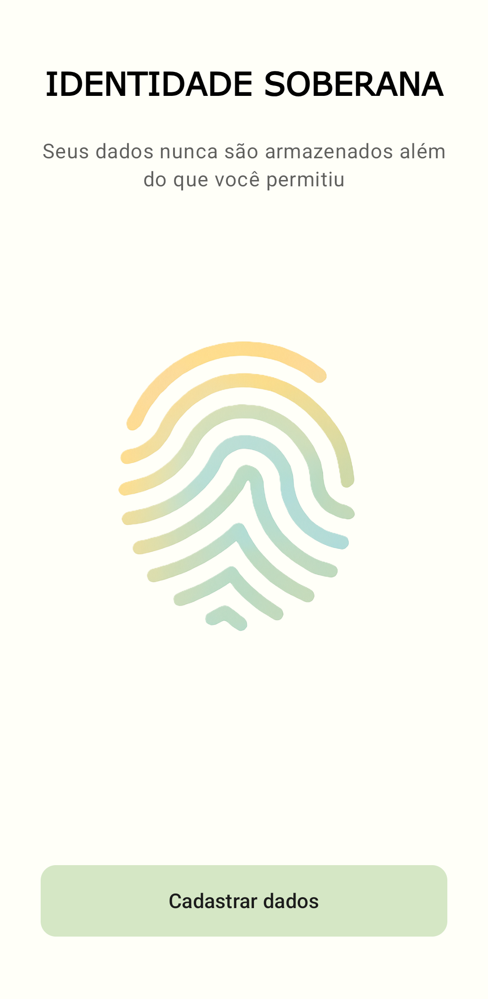
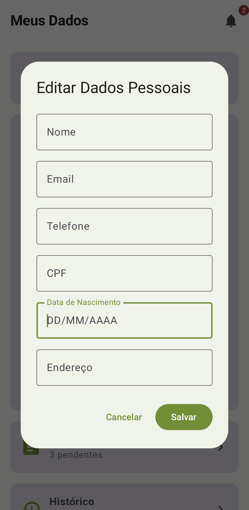
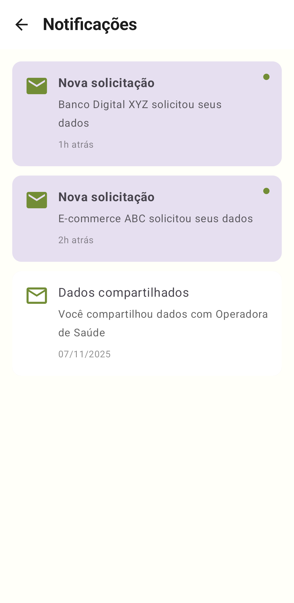
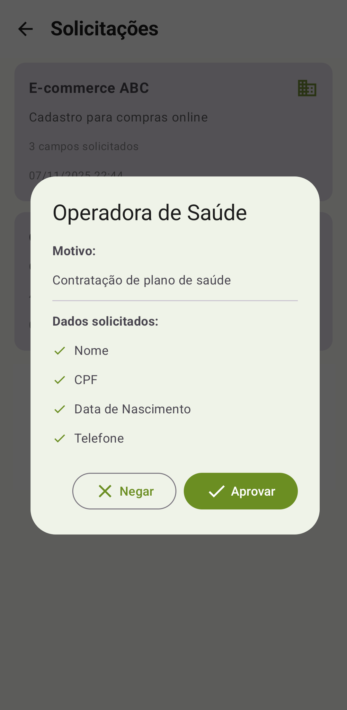
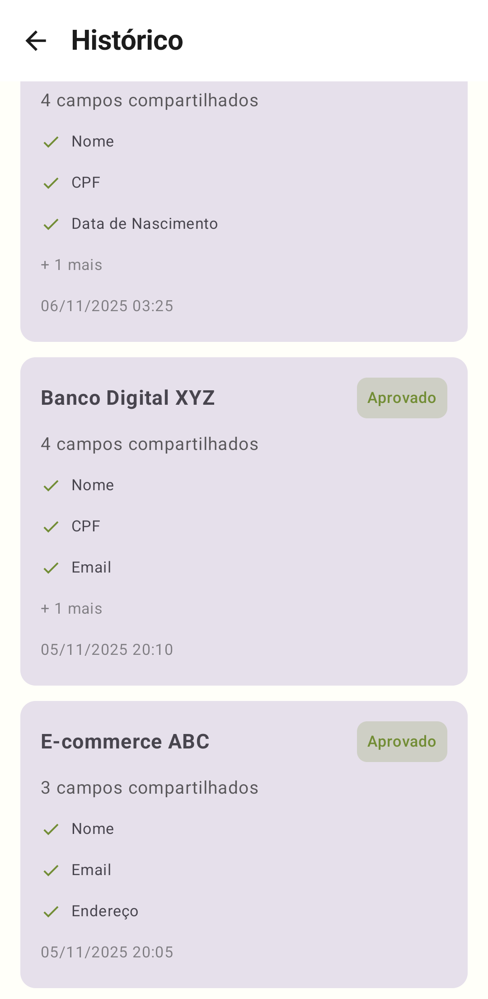
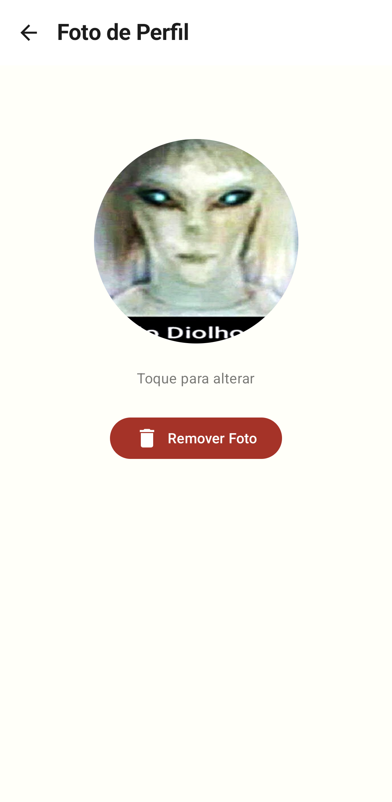
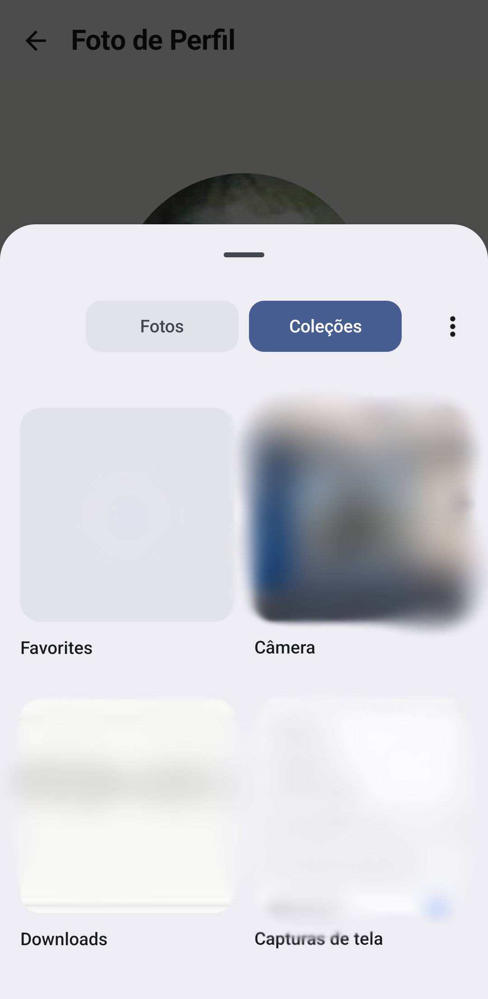

# 🔐 Identidade Soberana

<div align="center">


  
  

# **🗃️ Seus dados 📜 Suas regras 👑 Sua soberania**

**O cofre de dados pessoais mais seguro do mundo?, Talvez...** 🛡️

**[Arquitetura](#-arquitetura-técnica) • [Segurança](#-segurança-explicada)**

**Progresso:** 🔵🔵🔵🔵🔵🔵⚪ **90%**

</div>

---

## 🌟 O Problema

Você já parou para pensar em quantas empresas têm seus dados pessoais? CPF, endereço, telefone, e-mail... tudo espalhado por dezenas de bancos de dados que você não controla. E pior: **você nem sabe quem mais tem acesso.**

```
❌ ANTES: Empresa X tem todos os seus dados (e você torce para não vazar)
✅ AGORA: Você tem seus dados. Empresa X pede permissão. Você autoriza (ou não).
```

---

## ⚡ Destaques Técnicos

<table>
<tr>
<td width="36%" align="center">

### 🔒 Zero-Knowledge
Servidor **NUNCA vê** seus dados.  
Apenas roteia informações criptografadas.  
Dados saem ciptografados do dispositivo.  

</td>
<td width="36%" align="center">

### 🔑 Sistema Tri-Key
ECDSA P-256 + RSA-4096 + ECDH Curve25519.  
Perfect Forward Secrecy.  
Algoritmos Bouncy Castle.

</td>
<td width="36%" align="center">

### ✅ Controle Total
Consentimento granular explicito.  
Você decide com quem compartilhar.  
Auditoria completa, offline.  

</td>
</tr>
</table>


<table>
<tr>
<td width="25%" align="center">

### 🛡️ Proteção de menores
Bloqueio automático para menores de 16 anos no APP  
18 anos no servidor 

</td>
<td width="25%" align="center">

### 🛑 Totalmente Offline
Use agora, sincronize depois  
Cache inteligente  

</td>
<td width="25%" align="center">

### 📱 100% Android
Material 3, 99.6% Kotlin  
Criptografia feita no dispositivo  
Kotlin no Backend  

</td>
<td width="25%" align="center">

### 🔐 Criptografia Híbrida
Criptografia asincrona em modo de repouso  
Algoritmos de contexto, cálculo e lógica  

</td>
</tr>
</table>

---

## 🎯 Funcionalidades

<details closed>
<summary><b>🔐 Segurança & Criptografia</b></summary>

- **Criptografia híbrida AES-256 + RSA-4096** - Dados são protegidos por múltiplas camadas
- **Sistema Tri-Key** - Chave de identidade (ECDSA), chave de dados (RSA) e chave de sessão (ECDH)
- **Perfect Forward Secrecy (PFS)** - Chaves de sessão efêmeras com ECDH Curve25519
- **Assinaturas digitais RSA-PSS** - Garantia de integridade e não-repúdio
- **Android Keystore** - Chaves armazenadas em hardware seguro
- **FIDO2/Passkeys** - Autenticação sem senha usando biometria

</details>

<details>
<summary><b>👤 Controle & Privacidade</b></summary>

- **Compartilhamento granular** - Escolha campo por campo o que compartilhar
- **Aprovação biométrica** - Impressão digital ou reconhecimento facial
- **Histórico completo** - Saiba exatamente quem acessou o quê e quando
- **Revogação instantânea** - Cancele acesso a qualquer momento
- **Offline-first** - Funciona sem internet, sincroniza depois
- **Proteção de menores** - Bloqueio automático para usuários com menos de 16 anos

</details>

<details>
<summary><b>🚀 Tecnologia Moderna</b></summary>

- **Jetpack Compose** - UI 100% declarativa e moderna
- **Clean Architecture + MVVM** - Código organizado e testável
- **Coroutines + Flow** - Programação assíncrona eficiente
- **Room + Paging 3** - Cache inteligente com carregamento sob demanda
- **FCM Push** - Notificações em tempo real
- **Deep Links** - Abra solicitações direto da notificação
- **Material Design 3** - Interface seguindo padrões Google

</details>

<details>
<summary><b>🔄 Backup & Recuperação</b></summary>

- **4 métodos de backup** - Frase mnemônica, QR Code, arquivo ou revogação
- **Criptografia PBKDF2** - Backup protegido por senha forte
- **Restauração multi-dispositivo** - Recupere sua identidade em qualquer lugar
- **Sem perda de dados** - Sistema robusto de recuperação

</details>

---

## 🔬 Arquitetura Técnica

### Stack Completo

```kotlin
// Frontend
Kotlin + Jetpack Compose + Clean Architecture
Hilt (DI) + Coroutines + Flow + Room + Retrofit

// Segurança
Android Keystore + Bouncy Castle
AES-256-GCM + RSA-4096 + ECDSA P-256 + ECDH Curve25519
PBKDF2 + RSA-PSS + FIDO2 + BiometricPrompt

// Backend
Spring Boot + Redis + PostgreSQL
Rate Limiting (Bucket4j) + Webhooks + JWT
```

O app utiliza **Clean Architecture** com o padrão **MVVM (Model-View-ViewModel)**, separando o código em três camadas principais

**Presentation:** UI (Jetpack Compose) e lógica de apresentação (ViewModels).  
**Domain:** Lógica de negócio (Use Cases) e modelos de domínio.  
**Data:** Fontes de dados (Repositories, Room, Retrofit).  

---

## 🛡️ Segurança Explicada

### Como funciona o Sistema Tri-Key?

<table>
<tr>
<th>Chave</th>
<th>Algoritmo</th>
<th>Propósito</th>
<th>Características</th>
</tr>
<tr>
<td>🔑 Identidade</td>
<td>ECDSA P-256</td>
<td>ID único do usuário</td>
<td><b>Imutável</b> - Armazenada no Keystore</td>
</tr>
<tr>
<td>🔑 Dados</td>
<td>RSA-4096</td>
<td>Assinar dados compartilhados</td>
<td><b>Rotacionável</b> - Pode ser trocada</td>
</tr>
<tr>
<td>🔑 Sessão</td>
<td>ECDH Curve25519</td>
<td>Criptografar cada sessão</td>
<td><b>Efêmera</b> - Destruída após uso (PFS)</td>
</tr>
</table>

---


### Compatibilidade Criptográfica App ↔️ Backend

| Componente | App | Backend | Status |
|---|---|---|---|
| Curva ECDSA | P-256 (secp256r1) | P-256 | ✅ Compatível |
| Tamanho RSA | 4096 bits | 4096 bits | ✅ Compatível |
| Padding RSA | OAEP SHA-256 | OAEP SHA-256 | ✅ Compatível |
| Assinatura | RSA-PSS SHA-256 | RSA-PSS SHA-256 | ✅ Compatível |
| AES | GCM 256 bits | N/A | ✅ E2E |
| PFS | ECDH X25519 | ❌ Pendente | ⚠️ Em desenvolvimento |

---  

<div align="center">

## 📸 Tá, mas tem print?

<div align="center">

### Tem

<table>
<tr>
<td width="15%"></td>
<td width="15%"></td>
<td width="15%"></td>
<td width="15%"></td>
</tr>
<tr>
<td width="15%"></td>
<td width="15%"></td>
<td width="15%"></td>
<td width="15%"></td>
</tr>
</table>

</div>

*Imagens de aparelho físico rodando app*  

---  

## 📜 Licença

**MIT License**

Veja [LICENSE](./LICENSE) para detalhes completos.

---

<div align="center">

### 🌟 Se você acredita que privacidade é um direito, dê uma ⭐ neste projeto!

**Com 💙 para um mundo onde você controla seus dados**

[⬆ Voltar ao topo](#-identidade-soberana)

</div>

---
